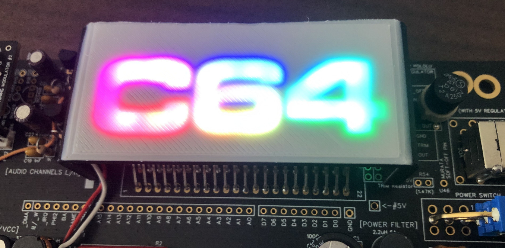

# Cover for the legendary Commodore C64 Expansions Port ( Cartridge Game port )

  

<code>
 - print upside down, 10% - 2ß% infill
 - only two top layers, so LEDs can shine trough
 - when LEDs are off, nothing can be seen
</code> 

  

  

  

  

<code>
You can print it in two colours, if You like.
Here the top is white, while the rest is black.
And 16 RGB-LEDs, two stripes of 8 LEDs each.
</code> 

  

  

  

Have fun ;-)

cassy

